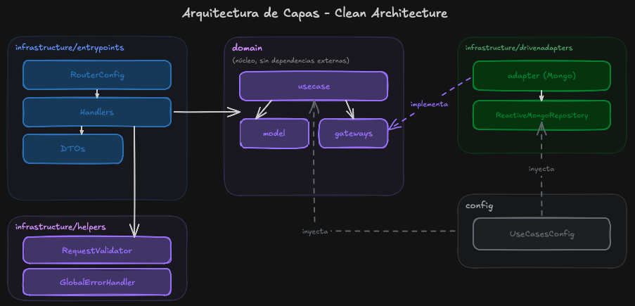
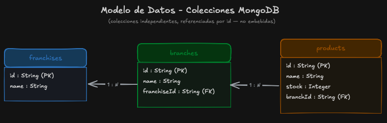
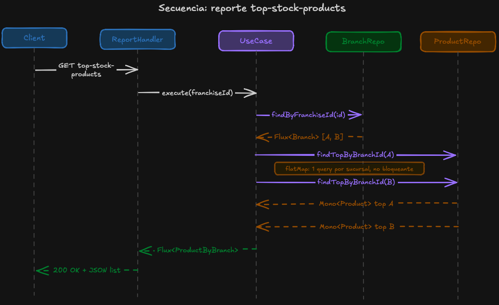
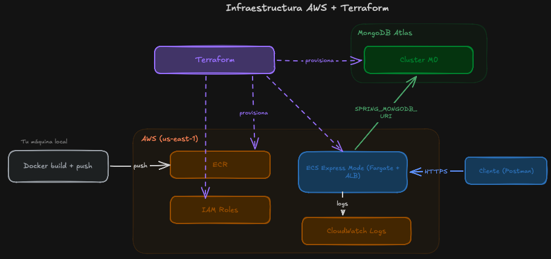

# Franquicias API

API reactiva para gestionar franquicias, sus sucursales y productos, construida con Spring Boot 4 y programación funcional/reactiva (WebFlux). Persiste en MongoDB y está desplegada en AWS mediante Infraestructura como Código (Terraform).

## Índice

1. [Descripción del proyecto](#descripción-del-proyecto)
2. [Arquitectura](#arquitectura)
3. [Modelo de datos](#modelo-de-datos)
4. [Flujo de un caso de uso](#flujo-de-un-caso-de-uso)
5. [Documentación de la API](#documentación-de-la-api)
6. [Variables de entorno](#variables-de-entorno)
7. [Despliegue local](#despliegue-local)
8. [Infraestructura en la nube](#infraestructura-en-la-nube)
9. [Despliegue en AWS](#despliegue-en-aws)
10. [Decisiones de diseño](#decisiones-de-diseño)

## Descripción del proyecto

Permite crear franquicias, agregar sucursales y productos, actualizar nombres y stock, eliminar productos, y consultar el producto con más stock de cada sucursal para una franquicia dada.

**Stack:**
- Java 21 + Spring Boot 4 (WebFlux, endpoints funcionales)
- MongoDB (Spring Data Reactive MongoDB)
- Docker / Docker Compose
- Terraform (MongoDB Atlas + AWS ECS Express Mode)
- JUnit 5 + Mockito + Reactor Test

## Arquitectura

Este proyecto adopta la convención de paquetes del *scaffold* de Clean Architecture de Bancolombia, adaptada de su estructura original en módulos Gradle (kebab-case) a un proyecto Maven de módulo único, con paquetes en camelCase: `domain.model`, `domain.usecase`, `infrastructure.entrypoints`, `infrastructure.drivenadapters`, `infrastructure.helpers`. El detalle de por qué se adoptó esta convención está en la sección de [Decisiones de diseño](#decisiones-de-diseño).



Como se observa en el diagrama las flechas siempre apuntan o el flujo siempre va *hacia* el dominio, nunca al revés, `domain` no depende de nada de `infrastructure`. El adapter de Mongo implementa la interfaz (`gateway`) que vive en el dominio, y es `UseCasesConfig` quien conecta el adapter concreto con cada caso de uso, ya que los casos de uso no tienen anotaciones de Spring y no pueden auto-detectarse.

## Modelo de datos

Tres colecciones de MongoDB independientes, relacionadas por referencia de id (no embebidas): `franchises`, `branches` (con `franchiseId`) y `products` (con `branchId`). El razonamiento detrás de este modelo está en [Decisiones de diseño](#decisiones-de-diseño).


## Flujo de un caso de uso

Secuencia del endpoint `GET /franchises/{franchiseId}/top-stock-products`, que devuelve el producto con más stock de cada sucursal de una franquicia.



Aca el diagrama nos muestra el paso `UseCase → ProductRepository` se resuelve con `flatMap`, se dispara una consulta por cada sucursal de la franquicia, de forma no bloqueante, en vez de traer todo a memoria y filtrar.

## Documentación de la API

Los 9 endpoints están documentados como una colección de Postman exportada — `franquicias-api.postman_collection.json`, en la raíz del repo. Se puede probrar importandola en Postman ademas se debe configurar la variable `base_url` en un environment (local o AWS), corrér los requests en orden (cada creación guarda el id que usa el siguiente).

Referencia rápida de endpoints:

| Método | Endpoint                                       | Body                               | Descripción                          |
|--------|------------------------------------------------|------------------------------------|--------------------------------------|
| POST   | `/franchises`                                  | `{ "name": "string" }`             | Crear franquicia                     |
| PATCH  | `/franchises/{franchiseId}/name`               | `{ "name": "string" }`             | Actualizar nombre de franquicia      |
| POST   | `/franchises/{franchiseId}/branches`           | `{ "name": "string" }`             | Agregar sucursal                     |
| PATCH  | `/branches/{branchId}/name`                    | `{ "name": "string" }`             | Actualizar nombre de sucursal        |
| POST   | `/branches/{branchId}/products`                | `{ "name": "string", "stock": 0 }` | Agregar producto                     |
| DELETE | `/products/{productId}`                        | —                                  | Eliminar producto                    |
| PATCH  | `/products/{productId}/stock`                  | `{ "stock": 0 }`                   | Actualizar stock de producto         |
| PATCH  | `/products/{productId}/name`                   | `{ "name": "string" }`             | Actualizar nombre de producto        |
| GET    | `/franchises/{franchiseId}/top-stock-products` | —                                  | Producto con más stock, por sucursal |

## Variables de entorno

Ningún archivo con credenciales reales se sube al repositorio. Hay dos archivos `.env.example` que documentan qué variables se necesitan, ojo sin sus valores:

- **`.env.example`** (raíz del proyecto): variables que usa la aplicación.
    - `SPRING_MONGODB_URI`: connection string de MongoDB. Ya viene resuelto en `docker-compose.yml` para uso local; solo hace falta si corrés la app fuera de Docker apuntando a otra base.

- **`terraform/.env.example`**: credenciales para provisionar infraestructura.
    - `MONGODB_ATLAS_PUBLIC_KEY` / `MONGODB_ATLAS_PRIVATE_KEY`: API keys de tu cuenta de Atlas (se configuran como variables de entorno del sistema, no en un archivo).
    - `atlas_org_id`, `db_password`: variables de Terraform (van en `terraform/terraform.tfvars`, ignorado por Git).

Las credenciales de AWS no van en ningún archivo: se configuran una sola vez con `aws configure` usando AWS CLI.

## Despliegue local

### Prerrequisitos
- Docker y Docker Compose instalados.

### Pasos
1. Cloná el repositorio y entrá a la carpeta del proyecto.
2. Levantá todo con:
   ```bash
   docker-compose up --build
   ```
   Esto levanta dos contenedores: la base de datos MongoDB y la API. La API queda disponible en `http://localhost:8080`.
3. Importá la colección de Postman (`franquicias-api.postman_collection.json`) y creá un environment con la variable `base_url = http://localhost:8080`.
4. Corré los requests de la colección en orden.

## Infraestructura en la nube

La API está desplegada en AWS usando Amazon ECS Express Mode, con la base de datos en MongoDB Atlas. Todo provisionado con Terraform.



## Despliegue en AWS

Hay dos formas de probar el despliegue en la nube:

### Opción A — Probar el despliegue ya activo
Mientras la infraestructura siga activa, la API está disponible en:

```
https://fr-e21e8a58306a4669a5814c8378953234.ecs.us-east-1.on.aws
```

Importá la misma colección de Postman, cambiá `base_url` a esa URL en el environment, y corré los requests.

### Opción B — Volver a desplegar desde cero
Si la infraestructura ya fue destruida, se puede reproducir el despliegue completo.

**Prerrequisitos:** Terraform, AWS CLI configurado (`aws configure`), cuenta de MongoDB Atlas con API keys generadas, y Docker.

1. Configurá las variables de entorno y `terraform.tfvars` según los archivos `.env.example` (ver sección [Variables de entorno](#variables-de-entorno)).
2. Provisioná el repositorio de imágenes en AWS:
   ```bash
   cd terraform
   terraform init
   terraform apply -target=aws_ecr_repository.api
   ```
3. Con la URL del repo que te devuelve el output, construir y subir la imagen:
   ```bash
   aws ecr get-login-password --region us-east-1 | docker login --username AWS --password-stdin <account-id>.dkr.ecr.us-east-1.amazonaws.com
   docker build -t franquicias-api .
   docker tag franquicias-api:latest <ecr-repo-url>:latest
   docker push <ecr-repo-url>:latest
   ```
4. Desplegar el resto de la infraestructura (roles IAM, servicio ECS):
   ```bash
   terraform apply
   ```
5. Confirmar que quedó arriba:
   ```bash
   curl https://<url-del-output>/actuator/health
   ```
   Debería responder `{"status":"UP"}`.
6. Cuando termines de probar, debes destruir la infraestructura para no generar costos:
   ```bash
   terraform destroy
   ```

## Decisiones de diseño

Resumen de las decisiones técnicas más relevantes.

**Persistencia y modelado**
- MongoDB (Spring Data Reactive MongoDB): integración reactiva madura.
- 3 colecciones separadas (`franchises`, `branches`, `products`) referenciadas por id, en vez de un documento anidado, para evitar el anti-patrón "Unbounded Arrays" y la contención de escritura de MongoDB.

**Arquitectura**
- Clean Architecture con la nomenclatura de Bancolombia (`domain/usecase`, `infrastructure/entry-points`, `infrastructure/driven-adapters`), tomado del blog de Bancolombia en Medium https://medium.com/bancolombia-tech/clean-architecture-aislando-los-detalles-4f9530f35d7a
- Endpoints funcionales (`RouterFunction`) en vez de `@RestController`, para el plus de programación funcional.
- El reporte de "producto con más stock por sucursal" se resuelve con composición reactiva (`flatMap`).

**Documentación de la API**
- Colección de Postman exportada en vez de Swagger, por un bug de compatibilidad de `springdoc-openapi` con Spring Boot 4 + WebFlux.

**Infraestructura (Terraform)**
- MongoDB Atlas en vez de Amazon DocumentDB, por costo y simplicidad de aprovisionamiento (el cluster igual queda alojado en AWS).
- Amazon ECS Express Mode en vez de AWS App Runner (descontinuado para clientes nuevos desde abril de 2026).

**Contenerización y control de versiones**
- Docker multi-stage build, para una imagen final liviana.
- GitHub Flow (`main` + `feature/*` + PR), sin Git Flow completo.